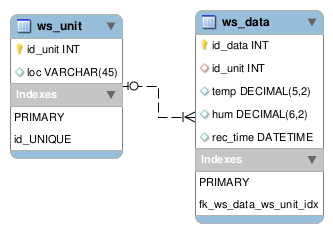

# <font face="Ubuntu"><font color="#808080">MY</font> <font color="#ff9900">METEO</font></font>

<font face="Ubuntu"><font color="#666666">**Demo application with control panel app, server and client app**</font></font>

### <font face="Ubuntu">Requirements</font>

<font face="Ubuntu">The app does not support IE8 and below, because it uses ECMAScript 5 features that are un-shimmable in IE8\. However it supports all ECMAScript 5 compliant browsers.</font>

<font face="Ubuntu">[https://www.npmjs.com/package/sqlite3#source-install](https://www.npmjs.com/package/sqlite3#source-install)</font> <font face="Ubuntu"><span style="background: transparent">The app is Node.js based, so to run you have to install it.</span> </font><font color="#333333"><font face="Ubuntu"><span style="background: transparent">Node.js 0.10 or higher is required.</span> </font></font>[<font face="Ubuntu"><span style="background: transparent">More details</span></font>](https://docs.npmjs.com/getting-started/installing-node)

### How its made

<span style="background: transparent"><font face="Ubuntu">- Backend : Node.js,</font> [<font face="Ubuntu">Express</font>](https://expressjs.com/)</span>

<span style="background: transparent"><font face="Ubuntu">- Frontend: [Vue.js](https://vuejs.org/)</font></span>

### Installation

Clone this repo
```sh
$ git clone https://github.com/rsmokov/weather-central-demo.git
```
And navigate to the folder
```sh
$ cd weather-central-demo
```
Open the terminal / bash and run
```sh
$ npm install
```
> **Note:**If an issue with the installation of the sqlite3 plugin occurs, than you must force to build installation from source.</font> [<font size="2">For more details see here</font>](https://www.npmjs.com/package/sqlite3#source-install)<font size="2">.</font>

### How to run the Application

Navigate to the main folder and just run :
```sh
$ npm start
```
### Application Structure

The app consist of three components.

1.  The Server /_comunication between the weather stations and the client_ / located under [./wcentral](./wcentral)

2.  The Weather stations. Managed and controlled by the **stations server and generator** [./wstations](./wstations) /.The control panel is located under

*   [index.js](./wstations/index.js)  the server / stations generator

*   [station.js](./wstations/station.js)  / The Station unit Abstraction

*   the control panel a Vue.js application under **./wstations/ws-control**

1.  The Client application a Vue.js application under **./wclient**

**Database Shema**

  

>Table for the weather station unit and table for the data emitted by each weather station.

### Communication protocol for the Weather Stations and the Main Server

Sending js objects via socket.io.

<table width="100%" border="1" bordercolor="#000000" cellpadding="5" cellspacing="0" rules="COLS"><colgroup><col width="22*"> <col width="38*"> <col width="90*"> <col width="24*"> <col width="82*"></colgroup>

<tbody>

<tr valign="TOP">

<td width="9%" bgcolor="#eeeeee">

<font color="#1c1c1c"><font size="2"><span style="background: transparent">Sender</span></font></font>

</td>

<td width="15%" bgcolor="#eeeeee">

<font color="#1c1c1c"><font size="2"><span style="background: transparent">Event name</span></font></font>

</td>

<td width="35%" bgcolor="#eeeeee">

<font color="#1c1c1c"><font size="2"><span style="background: transparent">Value</span></font></font>

</td>

<td width="9%" bgcolor="#eeeeee">

<font color="#1c1c1c"><font size="2"><span style="background: transparent">Receiver</span></font></font>

</td>

<td width="32%" bgcolor="#eeeeee">

<font color="#1c1c1c"><font size="2"><span style="background: transparent">Description</span></font></font>

</td>

</tr>

<tr valign="TOP">

<td width="9%" bgcolor="#eeeeee">

<font size="2">Station</font>

</td>

<td width="15%">

“<font size="2">wsCreated”</font>

</td>

<td width="35%">

<font size="2">Unit id</font>

<font size="2">(DataType : integer)</font>

</td>

<td width="9%" bgcolor="#eeeeee">

<font size="2">Server</font>

</td>

<td width="32%">

<font size="2">Event on Station Unit creation.</font>

<font size="2">/ adding new Unit to the server /</font>

</td>

</tr>

<tr valign="TOP">

<td width="9%" bgcolor="#eeeeee">

<font size="2">Station</font>

</td>

<td width="15%">

“<font size="2">wsEmitDB”</font>

</td>

<td width="35%">

<font size="2">Data = {</font>

<font size="2">id : “unit ID”,</font>

<font size="2">temp: “temperature”,</font>

<font size="2">hum: “humidity”,</font>

<font size="2">status: “state”</font>

<font size="2">}</font>

<font size="2">(DataType : Object)</font>

</td>

<td width="9%" bgcolor="#eeeeee">

<font size="2">Server</font>

</td>

<td width="32%">

<font size="2">Emitting data from each weather station to store it in to the database.</font>

<font size="2">_The status value is not stored._</font>

</td>

</tr>

<tr valign="TOP">

<td width="9%" bgcolor="#eeeeee">

<font size="2">Station</font>

</td>

<td width="15%">

“<font size="2">wsEmitViewr”</font>

</td>

<td width="35%">

<font size="2">Stations = [</font>

<font size="2">Data, //for station 1</font>

<font size="2">Data // for station 2</font>

…<font size="2">.]</font>

<font size="2">(DataType : Array)</font>

</td>

<td width="9%" bgcolor="#eeeeee">

<font size="2">Server</font>

</td>

<td width="32%">

<font size="2">Emitting all the stations data and passing it right to the client.</font>

</td>

</tr>

<tr>

<td colspan="5" width="100%" valign="TOP" bgcolor="#eeeeee">

<a name="tw-target-text"></a><font size="2">The following events are simulation of the weather station</font> <font size="2"><span lang="en">behavior</span></font>

</td>

</tr>

<tr valign="TOP">

<td width="9%" bgcolor="#eeeeee">

<font size="2">Server</font>

</td>

<td width="15%">

“<font size="2">wsmaintance”</font>

</td>

<td width="35%">

<font size="2">Unit id</font>

<font size="2">(DataType : integer)</font>

</td>

<td width="9%" bgcolor="#eeeeee">

<font size="2">Station</font>

</td>

<td width="32%">

<font size="2">Sending signal from the control panel so the station goes in maintance mode. Online, but no data is send, only the id and status.</font>

</td>

</tr>

<tr valign="TOP">

<td width="9%" height="46" bgcolor="#eeeeee">

<font size="2">Server</font>

</td>

<td width="15%">

“<font size="2">wsturnoff”</font>

</td>

<td width="35%">

<font size="2">Unit id</font>

<font size="2">(DataType : integer)</font>

</td>

<td width="9%" bgcolor="#eeeeee">

<font size="2">Station</font>

</td>

<td width="32%">

<font size="2">Sending signal from the control panel so the station goes off.</font>

</td>

</tr>

<tr valign="TOP">

<td width="9%" bgcolor="#eeeeee">

<font size="2">Server</font>

</td>

<td width="15%">

“<font size="2">wsalloff”</font>

</td>

<td width="35%">

<font size="2">_empty_</font>

</td>

<td width="9%" bgcolor="#eeeeee">

<font size="2">Station</font>

</td>

<td width="32%">

<font size="2">Sending signal from the control panel so all the stations go off.</font>

</td>

</tr>

</tbody>

</table>

## License
[MIT. Copyright (c)](https://opensource.org/licenses/MIT) Radoslav Smokov.
